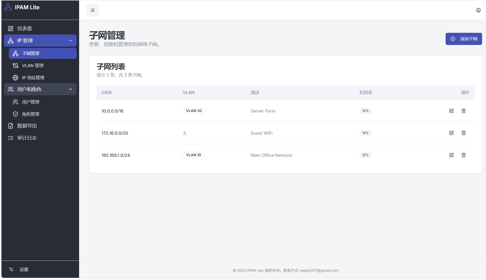

# 🌐 IPAM - 现代化 IP 地址管理系统

<div align="center">


**一个基于 Next.js 和 SQLite 的现代化 IP 地址管理系统**

[](#开源协议)
[](https://nodejs.org/)
[](https://nextjs.org/)
[](https://www.sqlite.org/)
[](https://docker.com/)

</div>

## 📋 项目概述

IPAM（IP Address Management）是一个功能强大的现代化 IP 地址管理系统，专为网络管理员和 IT 运维人员设计。系统采用最新的 Web 技术栈构建，提供直观的用户界面和完整的网络资源管理功能。

### ✨ 核心特性

- 🎨 **现代化 UI/UX**: 基于 ShadCN UI 和 Tailwind CSS 的精美界面
- 🔐 **安全可靠**: 完整的用户认证和基于角色的权限控制
- 📊 **全面管理**: VLAN、子网、IP 地址全生命周期管理
- 🔍 **智能搜索**: 强大的查询和过滤功能
- 📈 **批量操作**: 支持批量创建、删除和修改
- 📝 **审计日志**: 完整的操作记录和追踪
- 🐳 **容器化**: 完整的 Docker 支持
- 🚀 **高性能**: 基于 Next.js 的服务端渲染
- 📱 **响应式**: 完美适配桌面和移动设备

## 🛠️ 技术栈

### 前端技术

| 技术 | 版本 | 描述 |
|------|------|------|
| **Next.js** | 14.x | React 全栈框架，提供 SSR 和 API Routes |
| **React** | 18.x | 现代化前端框架 |
| **TypeScript** | 5.x | 类型安全的 JavaScript 超集 |
| **ShadCN UI** | Latest | 基于 Radix UI 的现代组件库 |
| **Tailwind CSS** | 3.x | 实用优先的 CSS 框架 |
| **React Hook Form** | 7.x | 高性能表单库 |
| **Zod** | 3.x | TypeScript 优先的模式验证库 |

### 后端技术

| 技术 | 版本 | 描述 |
|------|------|------|
| **Node.js** | 20.x | JavaScript 运行时环境 |
| **Prisma** | 5.x | 现代化数据库 ORM |
| **SQLite** | 3+ | 轻量级关系型数据库，嵌入式部署 |
| **NextAuth.js** | 4.x | 完整的认证解决方案 |

### UI 组件库

#### Radix UI 组件
- `@radix-ui/react-accordion` - 手风琴组件
- `@radix-ui/react-alert-dialog` - 警告对话框
- `@radix-ui/react-avatar` - 头像组件
- `@radix-ui/react-checkbox` - 复选框
- `@radix-ui/react-dialog` - 对话框
- `@radix-ui/react-dropdown-menu` - 下拉菜单
- `@radix-ui/react-label` - 标签组件
- `@radix-ui/react-menubar` - 菜单栏
- `@radix-ui/react-popover` - 弹出框
- `@radix-ui/react-progress` - 进度条
- `@radix-ui/react-radio-group` - 单选按钮组
- `@radix-ui/react-scroll-area` - 滚动区域
- `@radix-ui/react-select` - 选择器
- `@radix-ui/react-separator` - 分隔符
- `@radix-ui/react-sheet` - 侧边栏
- `@radix-ui/react-slot` - 插槽组件
- `@radix-ui/react-switch` - 开关
- `@radix-ui/react-tabs` - 标签页
- `@radix-ui/react-toast` - 提示消息
- `@radix-ui/react-tooltip` - 工具提示

#### 图标库
- `lucide-react` - 现代化图标库
- `@radix-ui/react-icons` - Radix 图标集

### 开发工具

| 工具 | 版本 | 描述 |
|------|------|------|
| **ESLint** | 8.x | 代码质量检查 |
| **Prettier** | 3.x | 代码格式化 |
| **PostCSS** | 8.x | CSS 后处理器 |
| **Autoprefixer** | 10.x | CSS 前缀自动添加 |

### 部署技术

| 技术 | 版本 | 描述 |
|------|------|------|
| **Docker** | 20.10+ | 容器化平台 |
| **Docker Compose** | 2.0+ | 多容器应用编排 |
| **Alpine Linux** | 3.18+ | 轻量级 Linux 发行版 |

## 🗄️ 数据库设计

### 核心数据模型


### 数据库特性

- **ACID 事务**: 确保数据一致性
- **外键约束**: 维护数据完整性
- **索引优化**: 提升查询性能
- **审计日志**: 完整的操作记录
- **数据加密**: 敏感信息安全存储

## 🏗️ 系统架构


## 📦 核心功能模块

### 🔐 用户管理
- 用户注册、登录、注销
- 基于角色的权限控制（RBAC）
- 用户资料管理
- 密码安全策略

### 🌐 VLAN 管理
- VLAN 创建、编辑、删除
- 批量 VLAN 操作
- VLAN 号码自动分配
- VLAN 使用统计

### 🔗 子网管理
- 子网规划和分配
- CIDR 计算和验证
- 子网利用率统计
- 网关配置管理

### 📍 IP 地址管理
- IP 地址分配和回收
- 批量 IP 操作
- IP 状态跟踪
- 冲突检测和解决

### 📊 数据字典
- 设备类型管理
- 接口类型管理
- 访问类型管理
- 付费来源管理

### 🔍 查询和报表
- 高级搜索功能
- 数据导出（Excel、CSV）
- 使用统计报表
- 审计日志查询

## 🚀 快速开始

### 系统要求

- **Node.js**: 18.0 或更高版本
- **SQLite**: 3.0 或更高版本
- **Docker**: 20.10 或更高版本（可选）
- **内存**: 4GB 或更多
- **存储**: 20GB 可用空间

### 环境变量配置

创建 `.env` 文件并配置以下变量：

```env
# 数据库配置
DATABASE_URL="file:./dev.db"

# 应用配置
NEXT_PUBLIC_BASE_URL=http://localhost:3000
PORT=3000
NODE_ENV=production

# 安全配置
ENCRYPTION_KEY=your_64_character_hex_string
NEXTAUTH_SECRET=your_nextauth_secret
```

### 本地开发

```bash
# 1. 克隆项目
git clone <repository-url>
cd studio

# 2. 安装依赖
npm install

# 3. 配置数据库
npx prisma migrate deploy
npm run prisma:db:seed

# 4. 启动开发服务器
npm run dev
```

## 📚 部署指南

### 🐳 Docker 部署

推荐使用 Docker 进行快速部署，详细步骤请参考：

**[📖 Docker 部署指南](./docs/docker-deployment-guide.md)**

该指南包含：
- 完整的 Docker 环境配置
- 容器编排和服务管理
- 数据持久化和备份策略
- 故障排除和性能优化

### 🐧 Linux 环境部署

对于生产环境，推荐在 Linux 服务器上原生部署：

**[📖 Linux 部署指南](./docs/linux-deployment-guide.md)**

该指南包含：
- 系统环境准备和依赖安装
- SQLite 数据库配置
- 应用服务配置和管理
- 反向代理和 SSL 配置
- 安全加固和监控设置

## 🔧 开发指南

### 项目结构

```
studio/
├── src/
│   ├── app/                 # Next.js App Router
│   │   ├── (dashboard)/     # 仪表板页面
│   │   ├── api/            # API 路由
│   │   └── login/          # 登录页面
│   ├── components/         # React 组件
│   │   ├── ui/            # 基础 UI 组件
│   │   ├── layout/        # 布局组件
│   │   └── dashboard/     # 业务组件
│   ├── hooks/             # 自定义 Hooks
│   ├── lib/               # 工具库
│   │   ├── actions.ts     # Server Actions
│   │   ├── prisma.ts      # 数据库客户端
│   │   └── utils.ts       # 工具函数
│   └── types/             # TypeScript 类型定义
├── prisma/                # 数据库模式和迁移
├── public/                # 静态资源
├── docs/                  # 项目文档
└── scripts/               # 部署脚本
```

### 开发规范

- **代码风格**: 使用 ESLint 和 Prettier
- **类型安全**: 严格的 TypeScript 配置
- **组件设计**: 遵循 ShadCN UI 设计原则
- **API 设计**: RESTful 风格的 API 接口
- **数据库**: 使用 Prisma 进行类型安全的数据库操作

### 贡献指南

1. Fork 项目仓库
2. 创建功能分支 (`git checkout -b feature/AmazingFeature`)
3. 提交更改 (`git commit -m 'Add some AmazingFeature'`)
4. 推送到分支 (`git push origin feature/AmazingFeature`)
5. 创建 Pull Request

## 📸 系统截图

<div align="center">

### 仪表板


### 用户管理


### VLAN 管理


### 子网管理


### IP 地址管理


### 批量操作


</div>

## 🔒 安全特性

- **数据加密**: 敏感数据使用 AES-256-CBC 加密
- **密码安全**: bcrypt 哈希加密存储
- **会话管理**: 安全的 JWT 令牌机制
- **权限控制**: 细粒度的 RBAC 权限系统
- **输入验证**: 严格的数据验证和清理
- **SQL 注入防护**: Prisma ORM 提供的安全查询
- **XSS 防护**: 自动的输出转义和 CSP 头
- **CSRF 防护**: 内置的 CSRF 令牌验证

## 📈 性能优化

- **服务端渲染**: Next.js SSR 提升首屏加载速度
- **代码分割**: 自动的路由级代码分割
- **图片优化**: Next.js Image 组件优化
- **缓存策略**: 多层缓存机制
- **数据库优化**: 索引优化和查询优化
- **CDN 支持**: 静态资源 CDN 加速

## 🧪 测试

```bash
# 运行测试
npm run test

# 运行测试覆盖率
npm run test:coverage

# 运行 E2E 测试
npm run test:e2e
```

## 📊 监控和日志

- **应用监控**: 内置的健康检查端点
- **错误追踪**: 完整的错误日志记录
- **性能监控**: 响应时间和资源使用监控
- **审计日志**: 用户操作完整记录
- **数据库监控**: 查询性能和连接池监控

## 🔄 版本更新

### 当前版本: v1.0.0

#### 新特性
- ✅ 完整的 IPAM 功能实现
- ✅ 现代化 UI/UX 设计
- ✅ Docker 容器化支持
- ✅ 完整的部署文档

#### 计划功能
- 🔄 API 接口文档
- 🔄 移动端适配优化
- 🔄 多语言支持
- 🔄 数据导入导出增强
- 🔄 网络拓扑可视化

## 📄 开源协议

本项目采用自定义开源协议：

### 🎯 使用条款

✅ **允许的使用方式：**
- 个人学习和研究
- 非商业用途的部署和使用
- 二次开发和功能扩展
- 代码参考和学习

❌ **禁止的使用方式：**
- 商业用途和盈利性使用
- 未经授权的商业分发
- 移除版权信息
- 恶意使用或破坏

### 📝 二次开发要求

如果您基于本项目进行二次开发：

1. **保留原始版权信息**
2. **开发文档必须提交到本项目**
3. **遵循相同的开源协议**
4. **不得用于商业用途**

### ⚖️ 免责声明

本软件按"现状"提供，不提供任何明示或暗示的担保。作者不对使用本软件造成的任何损失承担责任。

## 💝 支持项目

如果这个项目对您有帮助，欢迎通过以下方式支持：

### 💰 赞助支持

<div align="center">
  <b>支付宝赞助</b>
  <br>
  
  <br>
  <i>扫描二维码支持项目发展</i>
</div>

### 🌟 其他支持方式

- ⭐ 给项目点个 Star
- 🐛 提交 Bug 报告
- 💡 提出功能建议
- 📖 完善项目文档
- 🔄 分享给更多人

## 📞 联系作者

### 👨‍💻 作者信息

- **姓名**: jeerychao
- **微信**: 934090
- **邮箱**: leejie2017@gmail.com
- **GitHub**: [项目仓库地址]

### 💬 交流方式

- **技术问题**: 请通过 GitHub Issues 提交
- **商务合作**: 请发送邮件至 leejie2017@gmail.com
- **即时交流**: 微信 934090（请备注来意）

### 🕐 响应时间

- **GitHub Issues**: 通常在 24 小时内响应
- **邮件咨询**: 通常在 48 小时内回复
- **微信交流**: 工作日期间及时回复

---

<div align="center">

**感谢您对 IPAM 项目的关注和支持！**

*让网络管理变得更简单、更高效*

[](https://github.com/jeerychao)
[](https://nextjs.org/)
[](https://www.typescriptlang.org/)

</div>
